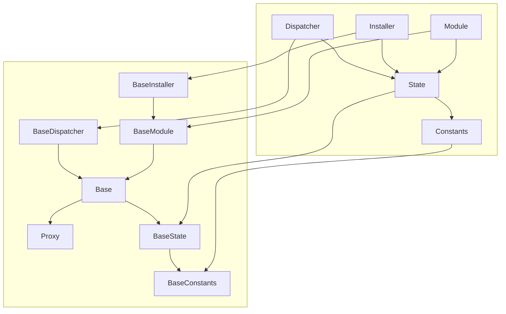
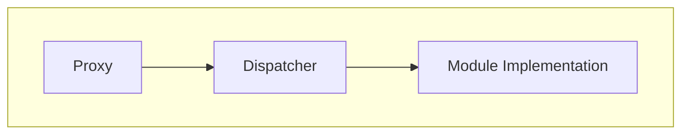
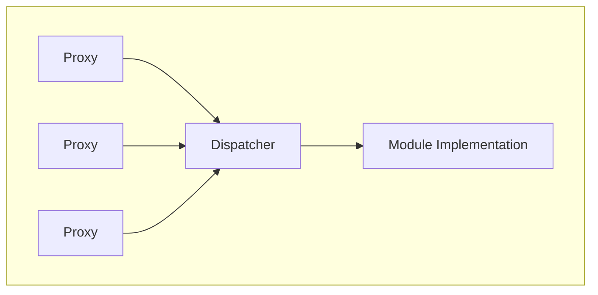
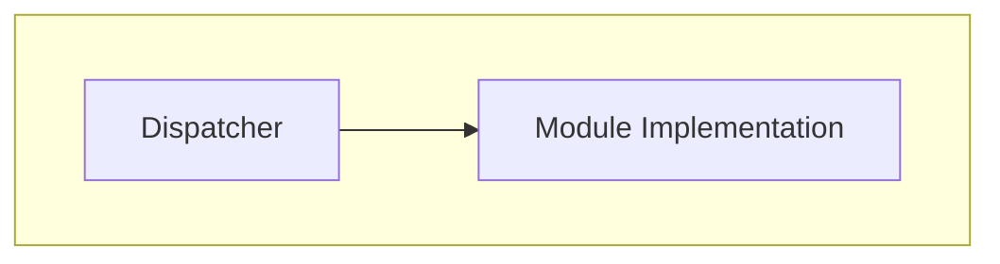
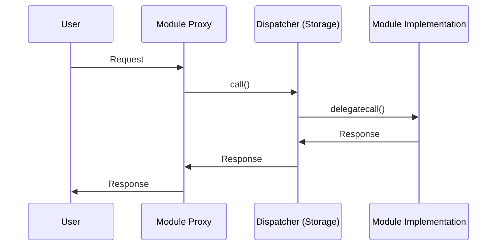

# Reflex

A first-generation Solidity framework for upgradeable modularized applications.

## Traits

- Provides a minimal, gas-optimized framework for building and maintaining upgradeable modularized applications.
- Modularization prevents hitting the Spurious Dragon maximum contract size limitation of ~24.5kb.
- Avoids function selector clashing alltogether, allowing you to have multiple spec-compliant modules run side-by-side.
- Multiple module types: single-proxy modules, multi-proxy modules and internal modules.
- Uses neutral language, avoids introducing new terminology.
- A built-in upgradeable installer allowing you to add, upgrade and remove modules throughout the application lifetime.

Noteably this is a so-called framework, a single well-tested implementation rather than a specification.
The framework serves as the foundation of your modular application allowing you to focus on your business logic.

## Contracts

```
.
├── BaseConstants.sol "Extendable `Constants`, constants used in the framework."
├── BaseDispatcher.sol "Non-upgradeable `Dispatcher`, entry point of the framework."
├── BaseModule.sol "Upgradeable `Module`, building block of the framework."
├── BaseState.sol "Extendable `State`, state store of the framework."
├── interfaces
│   ├── IBaseDispatcher.sol "Interface for the `Dispatcher`."
│   ├── IBaseInstaller.sol "Interface for the `Installer`."
│   ├── IBaseModule.sol "Interface for the `Module`."
│   ├── IBase.sol "Interface for the `Base`, internal building block."
│   └── IBaseState.sol "Interface for the `State`."
├── internals
│   ├── Base.sol "Extendable `Base`, internal abstraction for `Dispatcher` and `Module`.
│   └── Proxy.sol "Non-upgradeable `Proxy`, internal building block.
└── modules
    └── BaseInstaller.sol "Upgradeable `Installer`, built-in installer for modules."
```

## Inheritance snippet

```solidity
// SPDX-License-Identifier: AGPL-3.0-only
pragma solidity ^0.8.13;

// Vendor
import { BaseInstaller } from "reflex/modules/BaseInstaller.sol";
import { BaseConstants } from "reflex/BaseConstants.sol";
import { BaseDispatcher } from "reflex/BaseDispatcher.sol";
import { BaseModule } from "reflex/BaseModule.sol";
import { BaseState } from "reflex/BaseState.sol";

abstract contract Constants is BaseConstants {
  // ...
}

contract State is BaseState, Constants {
  // ...
}

contract Installer is BaseInstaller, State {
  constructor(uint16 moduleVersion_) BaseInstaller moduleVersion_) {}

  // ...
}

contract Dispatcher is BaseDispatcher, State {
  constructor(
    string memory name_,
    address owner_,
    address installerModule_
  ) BaseDispatcher(name_, owner_, installerModule_) {}

  // ...
}

contract ExampleModule is BaseModule, State {
  constructor(
    uint32 moduleId_,
    uint16 moduleType_,
    uint16 moduleVersion_
  ) BaseModule(moduleId_, moduleType_, moduleVersion_) {}

  // ...
}
```

## Inheritance diagram



### Single-proxy modules

Modules only accessible by a single `proxy` address and have a single `implementation` address.



### Multi-proxy modules

Modules that have many `proxy` addrresses and have a single `implementation` address.



### Internal-proxy modules

Modules that are called internally by the `Dispatcher` and don't have a `proxy` address.
Internal modules have the benefit that they are upgradeable whilst the `Dispatcher` itself is not.



## User flow



## Goals

- The core framework should be as minimalistic and lean as possible, aim for a "zero-cost abstraction".
- The core framework should have a highly optimized hot-path.
- Priveledged administrative functions should optimize for legibility and safety, focus on preventing footguns.
- Only the installer is required, all other modules are optional.

## Known limitations

- Multiple application entrypoints via their proxies.
- The `Dispatcher` and the internal `Proxy` contracts are not upgradable.
- Storage in the `Dispatcher` is extendable but implementers must remain vigilant to not cause storage clashes by defining storage slots directly inside of `Modules`.
- The first `50` storage slots are reserved allowing us to add new features over time.
- It is possible to possibly cause function selector clashes though the surface area is very small.
- Implementers MUST NOT implement an `implementation()` method in `Modules` as this causes a function selector clash in the `Proxy`.
- Implementers MUST NOT implement a `selfdestruct` inside of `Modules` as this causes disastrous unexpected behaviour.
- The registration of `Modules` MUST BE permissioned, malicious `Modules` can impact the behaviour of the entire application.

## Acknowledgements

The goal of the framework is to provide an alternative, and in some aspects superior, solution to the fundamental problem EIP-2535: [Diamond, Multi-Facet Proxy](https://eips.ethereum.org/EIPS/eip-2535) aims to solve namely to enable the creation of modular smart contract systems that can be extended after deployment.

The architecture is directly inspired by [Euler's Proxy Protocol](https://docs.euler.finance/developers/proxy-protocol) and we are thankful for their extensive documentation and novel modularization architecture.

The contracts and tests were inspired by or directly modified from many sources, primarily:

- [Euler](https://github.com/euler-xyz/euler-contracts)
- [Balancer V2](https://github.com/balancer-labs/balancer-v2-monorepo/tree/master/pkg/vault/contracts)
- [OpenZeppelin](https://github.com/OpenZeppelin/openzeppelin-contracts)
- [Solmate](https://github.com/transmissions11/solmate)
- [Solady](https://github.com/Vectorized/solady)

## License

Licensed under the [AGPL-3.0-only](/LICENSE) license.
