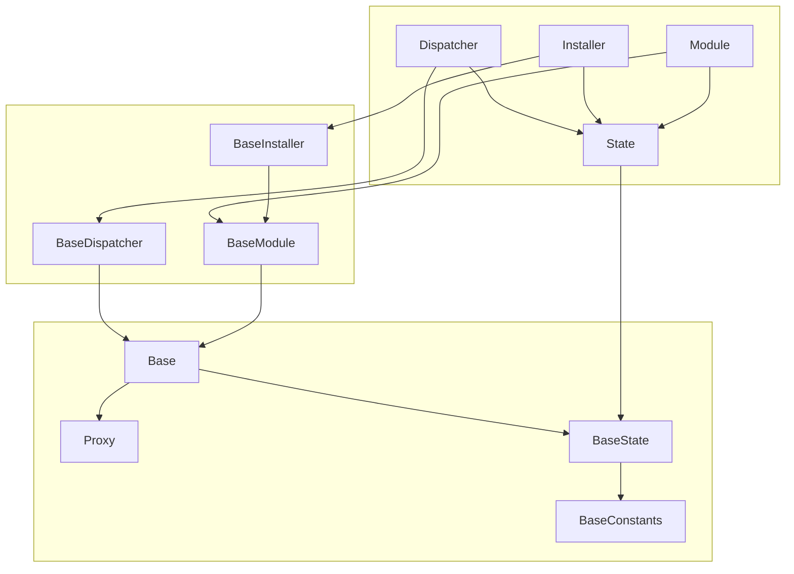

# Reflex

A first-generation Solidity framework for upgradeable modules.

## Traits

- Provides a minimal, gas-optimized framework for building and maintaining upgradeable modularized applications.
- Modularization prevents hitting the Spurious Dragon max contract size limitation of ~24.5kb.
- Avoids function selector clashing alltogether, allowing you to have multiple spec-compliant modules run side-by-side.
- Multiple module types: single-proxy modules, multi-proxy modules and internal modules.

## Diagram



## Contracts

```
.
├── BaseDispatcher.sol "Non-upgradeable `Dispatcher`, entry point of the framework."
├── BaseModule.sol "Upgradeable `Module`, building block of the framework."
├── BaseState.sol "Extendable `State`, state store of the framework."
├── interfaces
│   ├── IBaseDispatcher.sol "Interface for the `Dispatcher`."
│   ├── IBaseInstaller.sol "Interface for the `Installer`."
│   ├── IBaseModule.sol "Interface for the `Module`."
│   ├── IBase.sol "Interface for the `Base`, internal building block."
│   └── IBaseState.sol "Interface for the `State`."
├── internals
│   ├── Base.sol "Extendable `Base`, internal abstraction for `Dispatcher` and `Module`.
│   └── Proxy.sol "Non-upgradeable `Proxy`, internal building block.
└── modules
    └── BaseInstaller.sol "Upgradeable `Installer`, built-in installer for modules."
```

## Known limitations

- Multiple application entrypoints via their proxies.
- The `Dispatcher` and the internal `Proxy` contracts are not upgradable.

## Acknowledgements

These contracts were inspired by or directly modified from many sources, primarily:

- [Euler](https://github.com/euler-xyz/euler-contracts)
- [Balancer V2](https://github.com/balancer-labs/balancer-v2-monorepo/tree/master/pkg/vault/contracts)
- [OpenZeppelin](https://github.com/OpenZeppelin/openzeppelin-contracts)

## License

Licensed under the [AGPL-3.0-only](/LICENSE) license.
