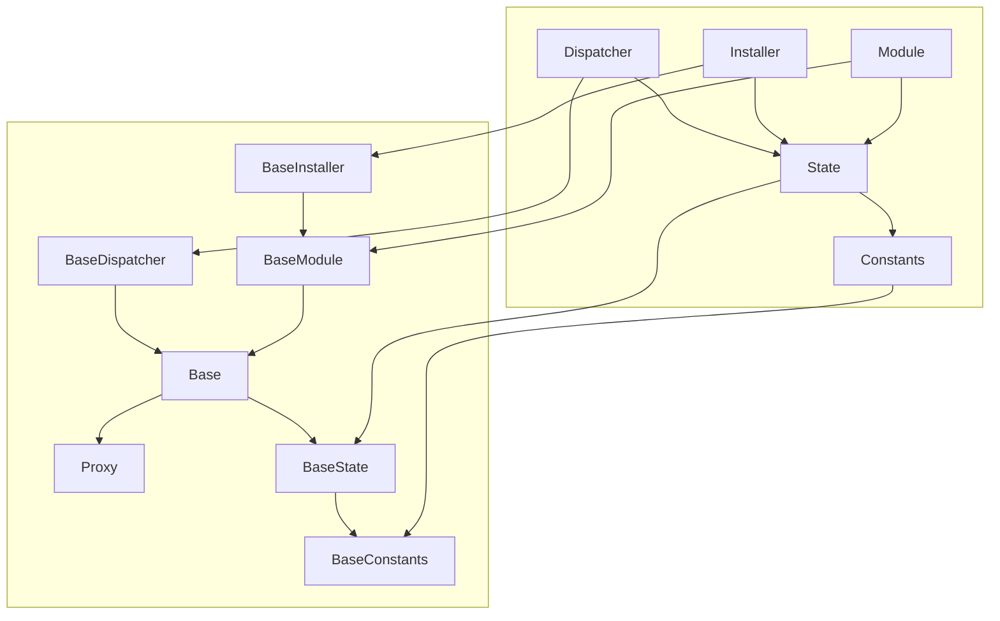
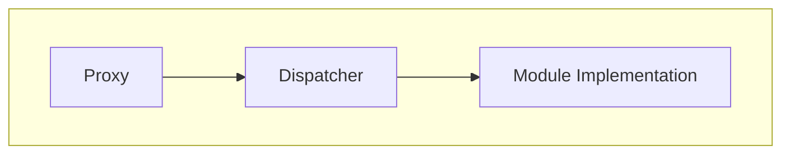
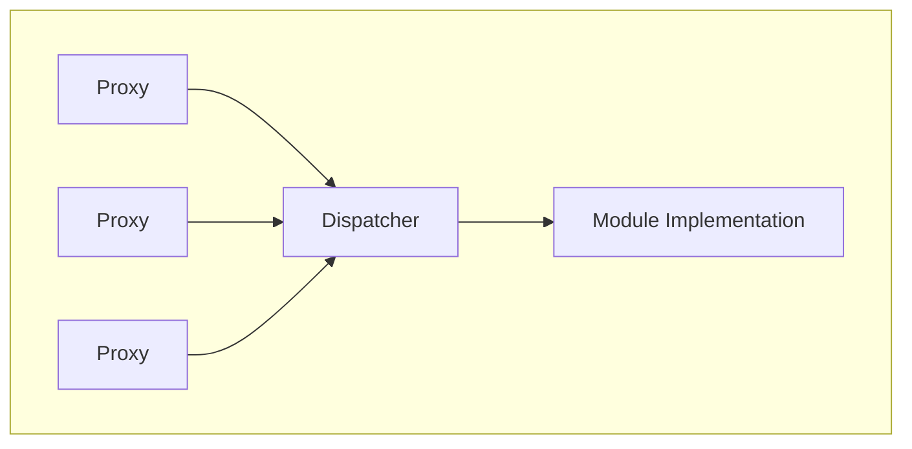
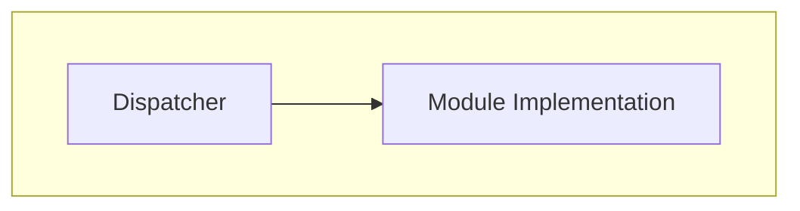
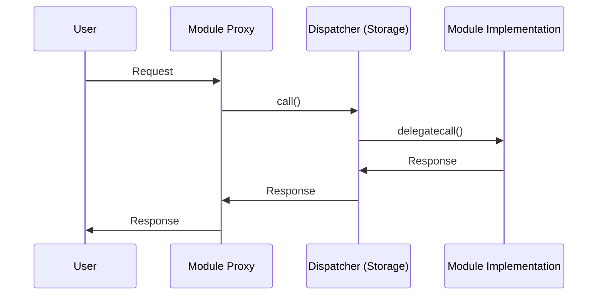

# Reflex

A Solidity framework for upgradeable modularized applications.

---

[![Tests][gha-contracts-badge]][gha-contracts] [![Linter][gha-lint-badge]][gha-lint] [![Foundry][foundry-badge]][foundry] [![License: AGPL-3.0][license-badge]][license]

[gha-contracts]: https://github.com/Chroma-Org/Reflex/actions/workflows/contracts.yml
[gha-contracts-badge]: https://github.com/Chroma-Org/Reflex/actions/workflows/contracts.yml/badge.svg
[gha-lint]: https://github.com/Chroma-Org/Reflex/actions/workflows/lint.yml
[gha-lint-badge]: https://github.com/Chroma-Org/Reflex/actions/workflows/lint.yml/badge.svg
[foundry]: https://getfoundry.sh/
[foundry-badge]: https://img.shields.io/badge/Built%20with-Foundry-DEA584.svg
[license]: https://www.gnu.org/licenses/agpl-3.0
[license-badge]: https://img.shields.io/badge/License-AGPL%203.0-blue

---

## Table of Contents

- [Reflex](#reflex)

  - [Table of Contents](#table-of-contents)
  - [Traits](#traits)
  - [Contracts](#contracts)
  - [Install](#install)
  - [Usage](#usage)
  - [Diagram](#diagram)
    - [Single-proxy modules](#single-proxy-modules)
    - [Multi-proxy modules](#multi-proxy-modules)
    - [Internal modules](#internal-modules)
    - [User interaction flow](#user-interaction-flow)
  - [Known limitations](#known-limitations)
  - [Safety](#safety)
  - [Contributing](#contributing)
  - [Acknowledgements](#acknowledgements)
  - [License](#license)

## Traits

- Provides a minimal, gas-optimized framework for building and maintaining upgradeable modularized applications.
- Modularization prevents hitting the Spurious Dragon maximum contract size limitation of ~24.5kb.
- Avoids function selector clashing alltogether, allowing you to have multiple spec-compliant modules run side-by-side.
- Multiple module types: single-proxy modules, multi-proxy modules and internal modules.
- Uses neutral language, avoids introducing new terminology.
- A built-in upgradeable installer allowing you to add, upgrade and remove modules throughout the application lifetime.

Noteably this is a so-called framework, a single well-tested audited implementation rather than a specification.
The framework serves as the foundation of your modular application allowing you to focus on your business logic.

## Contracts

```
.
├── BaseConstants.sol "Extendable `Constants`: constants used in the framework."
├── BaseDispatcher.sol "Non-upgradeable `Dispatcher`: dispatcher to module implementations"
├── BaseModule.sol "Upgradeable `Module`, foundational building block of modules."
├── BaseState.sol "Extendable `State`, foundational state store of the framework."
├── interfaces
│   ├── IBaseDispatcher.sol "Interface for the `Dispatcher`."
│   ├── IBaseInstaller.sol "Interface for the `Installer`."
│   ├── IBaseModule.sol "Interface for the `Module`."
│   ├── IBase.sol "Interface for the `Base`, internal."
│   ├── IBaseState.sol "Interface for the `State`."
│   └── Proxy.sol "Interface for the `Proxy`, internal."
├── internals
│   ├── Base.sol "Extendable `Base`, internal abstraction for `Dispatcher` and `Module`.
│   └── Proxy.sol "Non-upgradeable `Proxy`, internal proxy indirection layer.
└── modules
    └── BaseInstaller.sol "Upgradeable `Installer`, upgradeable built-in installer for modules."
```

## Install

To install with [**Foundry**](https://github.com/foundry-rs/foundry):

```sh
TODO: ADD LINK
```

To install with [**Hardhat**](https://github.com/nomiclabs/hardhat) or [**Truffle**](https://github.com/trufflesuite/truffle):

```sh
TODO: ADD LINK
```

## Usage

TODO: add code snippets and high-level overview

Please refer to the [IMPLEMENTERS](docs/IMPLEMENTERS.md) guide for more information.

## Diagram

TODO: add general description of how the framework works.



### Single-proxy modules

Modules that have a single proxy to a single implementation relation.



### Multi-proxy modules

Modules that have a multiple proxies to a single implementation relation.



### Internal modules

Modules that are called internally and don't have any public-facing proxies.
Internal modules have the benefit that they are upgradeable where the `Dispatcher` itself is not.



### User interaction flow



## Known limitations

- Multiple application entrypoints via their proxies. The proxy address stays consistent through module upgrades.
- The `Dispatcher` and the internal `Proxy` contracts are not upgradable.
- Storage in the `Dispatcher` is extendable but implementers must remain vigilant to not cause storage clashes by defining storage slots directly inside of `Modules`.
- The first `50` storage slots are reserved allowing us to add new features over time.
- It is possible to possibly cause function selector clashes though the surface area is very small.
- Implementers MUST NOT implement an `implementation()` method in `Modules` as this causes a function selector clash in the `Proxy`.
- Implementers MUST NOT implement a `selfdestruct` inside of `Modules` as this causes disastrous unexpected behaviour.
- The registration of `Modules` MUST BE permissioned, malicious `Modules` can impact the behaviour of the entire application.

## Contribute

Reflex includes a suite of fuzzing and invariant tests written in Solidity with Foundry.

To install Foundry:

```sh
curl -L https://foundry.paradigm.xyz | bash
```

This will download foundryup. To start Foundry, run:

```sh
foundryup
```

For convenience we use a [Makefile](/Makefile) for running different tasks.

To install dependencies:

```sh
make install
```

To build:

```sh
make build
```

To test:

```sh
make test
```

## Safety

This is **experimental software** and is provided on an "as is" and "as available" basis.

We **do not give any warranties** and **will not be liable for any loss** incurred through any use of this codebase.

## Contributing

Contributions to Reflex are welcome by anyone interested in writing more tests, improving readability, optimizing for gas efficiency, extending the core protocol or periphery modules.

Please refer to the [CONTRIBUTORS](docs/CONTRIBUTORS.md) guide for more information.

## Acknowledgements

The goal of the framework is to provide an alternative, and in some aspects superior, solution to the fundamental problem EIP-2535: [Diamond, Multi-Facet Proxy](https://eips.ethereum.org/EIPS/eip-2535) aims to solve namely to enable the creation of modular smart contract systems that can be extended after deployment.

The architecture is directly inspired by [Euler's Proxy Protocol](https://docs.euler.finance/developers/proxy-protocol) and we are thankful for their extensive documentation and novel modularization architecture.

The contracts and tests were inspired by or directly modified from many sources, primarily:

- [Euler](https://github.com/euler-xyz/euler-contracts)
- [OpenZeppelin](https://github.com/OpenZeppelin/openzeppelin-contracts)
- [Solmate](https://github.com/transmissions11/solmate)
- [Solady](https://github.com/Vectorized/solady)

## License

Licensed under the [AGPL-3.0-only](/LICENSE) license.
