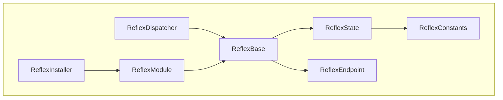

# Reflex

A Solidity framework for upgradeable modularized applications.

---

[![Tests][gha-contracts-badge]][gha-contracts] [![Linter][gha-lint-badge]][gha-lint] [![Foundry][foundry-badge]][foundry] [![License: GPL-3.0-or-later][license-badge]][license]

[gha-contracts]: https://github.com/Chroma-Org/Reflex/actions/workflows/contracts.yml
[gha-contracts-badge]: https://github.com/Chroma-Org/Reflex/actions/workflows/contracts.yml/badge.svg
[gha-lint]: https://github.com/Chroma-Org/Reflex/actions/workflows/lint.yml
[gha-lint-badge]: https://github.com/Chroma-Org/Reflex/actions/workflows/lint.yml/badge.svg
[foundry]: https://getfoundry.sh/
[foundry-badge]: https://img.shields.io/badge/Built%20with-Foundry-DEA584.svg
[license]: https://www.gnu.org/licenses/gpl-3.0
[license-badge]: https://img.shields.io/badge/License-GPL--3.0--or--later-blue

---

## Table of Contents

- [Table of Contents](#table-of-contents)
- [Traits](#traits)
- [Contracts](#contracts)
- [Install](#install)
- [Usage](#usage)
  - [Install Commands](#install-commands)
  - [Build Commands](#build-commands)
  - [Test Commands](#test-commands)
- [Safety](#safety)
- [Contributing](#contributing)
- [Acknowledgements](#acknowledgements)
- [License](#license)

## Traits

- Provides a minimal, gas-optimized framework for building and maintaining upgradeable modularized applications.
- Modularization prevents hitting the Spurious Dragon maximum contract size limitation of `24576` bytes.
- Avoids function selector clashing allowing you to run multiple spec-compliant modules side-by-side.
- Multiple module types: `single-endpoint` modules, `multi-endpoint` modules and `internal` modules.
- Uses neutral language, avoids introducing new terminology.
- Relatively minimal overhead for the features it provides:
  - [~8048](test/ImplementationGas.t.sol) gas on the initial cold call.
  - [~1048](test/ImplementationGas.t.sol) gas on the subsequent warm call.
  - [~14967](test/ImplementationGas.t.sol) gas on the initial cold batched transaction call.
  - [~3467](test/ImplementationGas.t.sol) gas on the subsequent warm batched transaction call.
- A built-in upgradeable installer allowing you to add, upgrade and deprecate modules throughout the application lifespan.
- Has a global reentrancy lock capable of covering every storage-modifying method in the inheriting application.

Noteably this is a so-called framework, a single well-tested implementation rather than a specification.
The framework serves as the foundation of your modular application allowing you to focus on your business logic.

## Why?

In the public discourse there is a lot of valid critique towards the use of (upgradeable) proxy patterns namely that they are difficult to manage, vulnerable if configured incorrectly, broadly unnecessary and in general over-complex and over-engineered.

If you can get away without having to use a proxy please do so, it is better to do so in almost all cases. Build libre, permissionless and immutable systems whenever you can.

There are however situations where you run into contract size limitations and you are looking for a reasonable way to modularize your architecture, you would like to expand the feature set of your product over time, allow bugs to be fixed in the early days of a protocol or you want to separate your business logic from your architecture to reduce mental overhead.

Until now some projects have relied on the [Diamond Proxy](https://eips.ethereum.org/EIPS/eip-2535) pattern in an effort to address these issues. Reflex aims to be a better solution to the core problem the Diamond Proxy standard aims to resolve but fails to address.

The Solidity ecosystem has been using libraries and collections of code snippets intended to be composed together. We propose that the natural evolution are barebone, comprehesive and opiniated frameworks and this is the first of its kind.

## Contracts

```
.
├── ReflexBase.sol "Extendable `Base`, internal abstraction for `Dispatcher` and `Module`."
├── ReflexConstants.sol "Extendable `Constants`: constants used in the framework."
├── ReflexDispatcher.sol  "Non-upgradeable `Dispatcher`: dispatcher to module implementations."
├── ReflexEndpoint.sol "Non-upgradeable `Endpoint`, internal proxy-like indirection layer."
├── ReflexInstaller.sol "Upgradeable `Installer`, upgradeable built-in installer for modules."
├── ReflexModule.sol
├── ReflexState.sol "Extendable `State`, state store of the framework inherited in all modules."
├── interfaces
    ├── IReflexBase.sol "Interface for the `Base`."
    ├── IReflexDispatcher.sol "Interface for the `Dispatcher`."
    ├── IReflexEndpoint.sol "Interface for the `Endpoint`."
    ├── IReflexInstaller.sol "Interface for the `Installer`."
    ├── IReflexModule.sol "Interface for the `Module`."
│   └── IReflexState.sol "Interface for the `State`."
└── periphery
    ├── ReflexBatch.sol "Upgradeable `Batch`, upgradeable batch call for modules."
    └── interfaces
        └── IReflexBatch.sol "Interface for the `Batch`."
```



## Install

To install for [**Foundry**](https://github.com/foundry-rs/foundry):

```sh
TODO: ADD LINK
```

To install for [**Hardhat**](https://github.com/nomiclabs/hardhat):

```sh
TODO: ADD LINK
```

## Usage

Reflex includes a suite of unit and fuzz tests written in Solidity with Foundry.

Please refer to the [IMPLEMENTERS](docs/IMPLEMENTERS.md) guide for an in-depth breakdown of the framework.

To install Foundry:

```sh
curl -L https://foundry.paradigm.xyz | bash
```

This will download foundryup. To start Foundry, run:

```sh
foundryup
```

For convenience we use a [Makefile](/Makefile) for running different tasks.

### Install Commands

| Command                  | Action                    |
| ------------------------ | ------------------------- |
| `make` or `make install` | Install all dependencies. |

### Build Commands

Build profiles: `default`, `min-solc`, `via-ir`, `min-solc-via-ir`.

Usage: `PROFILE=default make build`.

| Command                                      | Action                                            |
| -------------------------------------------- | ------------------------------------------------- |
| `make build` or `PROFILE=default make build` | Compile all contracts with the `default` profile. |
| `make clean`                                 | Delete all cached build files.                    |

### Test Commands

Build profiles: `default`, `min-solc`, `via-ir`, `min-solc-via-ir`.

Test profiles: `default`, `intense`.

Usage: `PROFILE=default make test`.

| Command                                    | Action                                    |
| ------------------------------------------ | ----------------------------------------- |
| `make test` or `PROFILE=default make test` | Run all tests with the `default` profile. |

## Safety

This is **experimental software** and is provided on an "as is" and "as available" basis.

We **do not give any warranties** and **will not be liable for any loss** incurred through any use of this codebase.

At this point in time Reflex **has not yet been audited** and must therefore not yet be used in production.

## Known limitations

Please refer to the [IMPLEMENTERS](docs/IMPLEMENTERS.md#security-assumptions-and-known-limitations) guide for a list of known limitations and security assumptions.

## Contributing

Please refer to the [CONTRIBUTORS](docs/CONTRIBUTORS.md) guide for more information.

We are currently still in an experimental phase leading up to a first audit and would love to hear your feedback on how we can improve Reflex. Contributions are welcome by anyone interested in writing more tests, improving readability, optimizing for gas efficiency, simplifying the core protocol further or adding periphery modules.

## Acknowledgements

The goal of the framework is to provide an alternative, and in some aspects superior, solution to the fundamental problem EIP-2535: [Diamond, Multi-Facet Proxy](https://eips.ethereum.org/EIPS/eip-2535) aims to solve namely to enable the creation of modular smart contract systems that can be extended after deployment.

The architecture is directly inspired by [Euler's Proxy Protocol](https://docs.euler.finance/developers/proxy-protocol) and we are thankful for their extensive documentation and novel modularization architecture.

The original idea of what a Solidity framework may look like has been inspired by [Olympus DAO's Default Framework](https://github.com/fullyallocated/Default).

The contracts and tests were inspired by or directly modified from many sources, primarily:

- [Euler](https://github.com/euler-xyz/euler-contracts) - `GPL-2.0-or-later`
- [EIP-2535: Diamonds, Multi-Facet Proxy](https://eips.ethereum.org/EIPS/eip-2535) - `CC0`

## License

Licensed under the [GPL-3.0-or-later](/LICENSE) license.

For third party licenses please refer to [THIRD_PARTY_LICENSES](/THIRD_PARTY_LICENSES).
