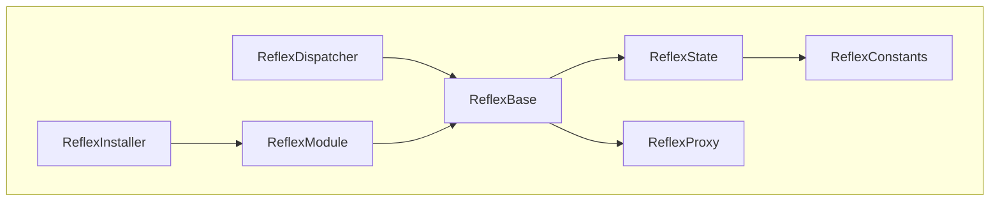

# Reflex

A Solidity framework for upgradeable modularized applications.

---

[![Tests][gha-contracts-badge]][gha-contracts] [![Linter][gha-lint-badge]][gha-lint] [![Foundry][foundry-badge]][foundry] [![License: GPL-3.0-or-later][license-badge]][license]

[gha-contracts]: https://github.com/Chroma-Org/Reflex/actions/workflows/contracts.yml
[gha-contracts-badge]: https://github.com/Chroma-Org/Reflex/actions/workflows/contracts.yml/badge.svg
[gha-lint]: https://github.com/Chroma-Org/Reflex/actions/workflows/lint.yml
[gha-lint-badge]: https://github.com/Chroma-Org/Reflex/actions/workflows/lint.yml/badge.svg
[foundry]: https://getfoundry.sh/
[foundry-badge]: https://img.shields.io/badge/Built%20with-Foundry-DEA584.svg
[license]: https://www.gnu.org/licenses/gpl-3.0
[license-badge]: https://img.shields.io/badge/License-GPL--3.0--or--later-blue

---

## Table of Contents

- [Table of Contents](#table-of-contents)
- [Traits](#traits)
- [Contracts](#contracts)
- [Install](#install)
- [Usage](#usage)
  - [Install Commands](#install-commands)
  - [Build Commands](#build-commands)
  - [Test Commands](#test-commands)
- [Safety](#safety)
- [Contributing](#contributing)
- [Acknowledgements](#acknowledgements)
- [License](#license)

## Traits

- Provides a minimal, gas-optimized framework for building and maintaining upgradeable modularized applications.
- Modularization prevents hitting the Spurious Dragon maximum contract size limitation of `24576` bytes.
- Avoids function selector clashing allowing you to run multiple spec-compliant modules side-by-side.
- Multiple module types: `single-proxy` modules, `multi-proxy` modules and `internal` modules.
- Uses neutral language, avoids introducing new terminology.
- Relatively minimal overhead for the features it provides: [~8065](test/ImplementationGas.t.sol) gas on the initial call and [~1065](test/ImplementationGas.t.sol) gas on subsequent calls in a batched transaction.
- A built-in upgradeable installer allowing you to add, upgrade and deprecate modules throughout the application lifespan.

Noteably this is a so-called framework, a single well-tested audited implementation rather than a specification.
The framework serves as the foundation of your modular application allowing you to focus on your business logic.

## Contracts

```
.
├── ReflexConstants.sol "Extendable `Constants`: constants used in the framework."
├── ReflexDispatcher.sol "Non-upgradeable `Dispatcher`: dispatcher to module implementations."
├── ReflexInstaller.sol "Upgradeable `Installer`, upgradeable built-in installer for modules."
├── ReflexModule.sol "Upgradeable `Module`, foundational building block of modules."
├── ReflexProxy.sol "Non-upgradeable `Proxy`, internal proxy indirection layer."
├── ReflexBase.sol "Extendable `Base`, internal abstraction for `Dispatcher` and `Module`."
├── ReflexState.sol "Extendable `State`, foundational state store of the framework."
└── interfaces
    ├── IReflexDispatcher.sol "Interface for the `Dispatcher`."
    ├── IReflexInstaller.sol "Interface for the `Installer`."
    ├── IReflexModule.sol "Interface for the `Module`."
    ├── IReflexProxy.sol "Interface for the `Proxy`."
    ├── IReflexBase.sol "Interface for the `Base`."
    └── IReflexState.sol "Interface for the `State`."
```



## Install

To install with [**Foundry**](https://github.com/foundry-rs/foundry):

```sh
TODO: ADD LINK
```

To install with [**Hardhat**](https://github.com/nomiclabs/hardhat) or [**Truffle**](https://github.com/trufflesuite/truffle):

```sh
TODO: ADD LINK
```

## Usage

Reflex includes a suite of fuzzing and invariant tests written in Solidity with Foundry.

Please refer to the [IMPLEMENTERS](docs/IMPLEMENTERS.md) guide for an in-depth breakdown of the framework.

To install Foundry:

```sh
curl -L https://foundry.paradigm.xyz | bash
```

This will download foundryup. To start Foundry, run:

```sh
foundryup
```

For convenience we use a [Makefile](/Makefile) for running different tasks.

### Install Commands

| Command                  | Action                    |
| ------------------------ | ------------------------- |
| `make` or `make install` | Install all dependencies. |

### Build Commands

Build profiles: `default`, `min-solc`, `via-ir`, `min-solc-via-ir`.

Usage: `PROFILE=default make build`.

| Command                                      | Action                                            |
| -------------------------------------------- | ------------------------------------------------- |
| `make build` or `PROFILE=default make build` | Compile all contracts with the `default` profile. |
| `make clean`                                 | Delete all cached build files.                    |

### Test Commands

Build profiles: `default`, `min-solc`, `via-ir`, `min-solc-via-ir`.

Test profiles: `default`, `intense`, `bounded`, `unbounded`.

Usage: `PROFILE=default make test`.

| Command                                                        | Action                                              |
| -------------------------------------------------------------- | --------------------------------------------------- |
| `make test` or `PROFILE=default make test`                     | Run all tests with the `default` profile.           |
| `make test-unit` or `PROFILE=default make test-unit`           | Run all unit tests with the `default` profile.      |
| `make test-fuzz` or `PROFILE=default make test-fuzz`           | Run all fuzz tests with the `default` profile.      |
| `make test-invariant` or `PROFILE=default make test-invariant` | Run all invariant tests with the `default` profile. |

## Safety

This is **experimental software** and is provided on an "as is" and "as available" basis.

We **do not give any warranties** and **will not be liable for any loss** incurred through any use of this codebase.

## Contributing

Contributions to Reflex are welcome by anyone interested in writing more tests, improving readability, optimizing for gas efficiency, extending the core protocol or periphery modules.

Please refer to the [CONTRIBUTORS](docs/CONTRIBUTORS.md) guide for more information.

## Acknowledgements

The goal of the framework is to provide an alternative, and in some aspects superior, solution to the fundamental problem EIP-2535: [Diamond, Multi-Facet Proxy](https://eips.ethereum.org/EIPS/eip-2535) aims to solve namely to enable the creation of modular smart contract systems that can be extended after deployment.

The architecture is directly inspired by [Euler's Proxy Protocol](https://docs.euler.finance/developers/proxy-protocol) and we are thankful for their extensive documentation and novel modularization architecture.

The contracts and tests were inspired by or directly modified from many sources, primarily:

- [Euler](https://github.com/euler-xyz/euler-contracts) - `GPL-2.0-or-later`
- [EIP-2535: Diamonds, Multi-Facet Proxy](https://eips.ethereum.org/EIPS/eip-2535) - `CC0`

## License

Licensed under the [GPL-3.0-or-later](/LICENSE) license.

For third party licenses please refer to [THIRD_PARTY_LICENSES](/THIRD_PARTY_LICENSES).
