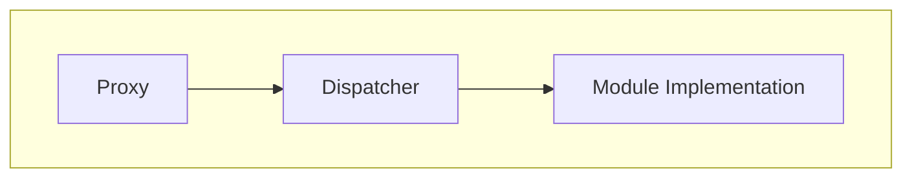
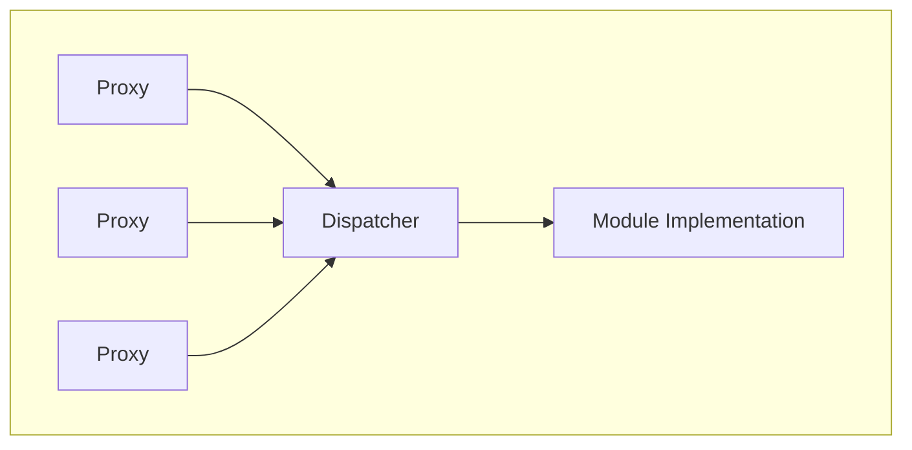
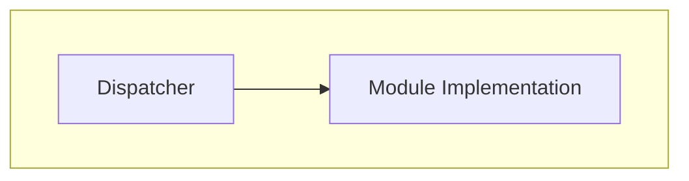
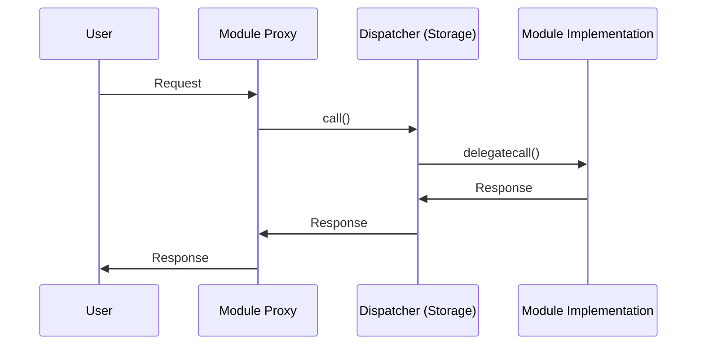
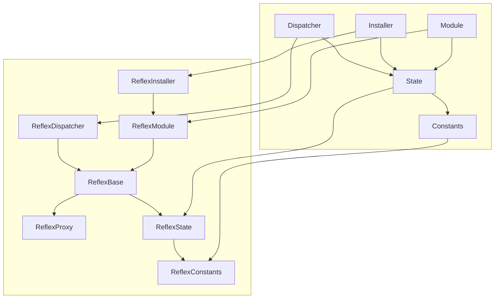

# Implementers

## Table of Contents

- [Table of Contents](#table-of-contents)
- [Modules](#modules)
  - [Single-proxy modules](#single-proxy-modules)
  - [Multi-proxy modules](#multi-proxy-modules)
  - [Internal modules](#internal-modules)
  - [User interaction flow](#user-interaction-flow)
- [Proxy](#proxy)
  - [Proxy => Dispatcher](#proxy--dispatcher)
  - [Dispatcher => Module](#dispatcher--module)
  - [Module => Proxy](#module--proxy)
- [Implementing](#implementing)
- [Framework deployment](#framework-deployment)
- [Module deployment](#module-deployment)
- [Numerical limitations](#numerical-limitations)
- [Acknowledgements](#acknowledgements)

## Modules

Reflex supports multiple types of modules out of the box:

- [Single-proxy modules](#single-proxy-modules)
- [Multi-proxy modules](#multi-proxy-modules)
- [Internal modules](#internal-modules)

Since modules are invoked by `DELEGATECALL` they should **NOT** have any storage-related initialization in their constructors. The only thing that should be done in their constructors is to initialize immutable variables, since these are embedded into the contract's bytecode, not storage. Modules also should not define any storage variables. In the rare cases they need private storage, they should use unstructured storage.

### Single-proxy modules

Modules that have a single proxy to a single implementation relation.
This is the most common type of module.



### Multi-proxy modules

Modules that have a multiple proxies to a single implementation relation.]
It is relatively uncommon that one needs this type of module.



### Internal modules

Modules that are called internally and don't have any public-facing proxies.
Internal modules have the benefit that they are upgradeable where the `Dispatcher` itself is not.



### User interaction flow

From the users' perspective the flow of interaction looks as follows:



## Proxy

Proxies are non-upgradeable contracts that have two jobs:

- Forward method calls from external users to the `Dispatcher`.
- Receive method calls from the `Dispatcher` and log events as instructed.

Although proxies themselves are non-upgradeable, they integrate with Reflex's module system, which does allow for upgrades.

Modules cannot be called directly. Instead, they must be invoked through a proxy.
By default, all proxies are implemented by the same code: [src/ReflexProxy.sol](../src/ReflexProxy.sol). This is a very simple contract that forwards its requests to the `Dispatcher`, along with the original `msg.sender`. The call is done with a normal `call()`, so the execution takes place within the `Dispatcher` contract's storage context, not the proxy's.

Proxies contain the bare minimum amount of logic required for forwarding. This is because they are not upgradeable. They should ideally be as optimized as possible so as to minimise gas costs since many of them will be deployed.

The `Dispatcher` contract ensures that all requests to it are from a known trusted proxy address. The only way that addresses can become known trusted is when the `Dispatcher` contract itself creates them. In this way, the original `msg.sender` sent by the proxy can be trusted.

The only other thing that proxies do is to accept messages from the `Dispatcher` that instruct them to issue log messages as mentioned above.

One important feature provided by the proxy/module system is that a single storage context (i.e. the `Dispatcher` contract) can have multiple possibly-colliding function ABI namespaces, which is not possible with systems like a conventional upgradeable proxy, or the [EIP-2535 Diamond, Multi-Facet Proxy](https://eips.ethereum.org/EIPS/eip-2535) standard. An example of how this works in practice can be found in [test/implementations/abstracts/ImplementationERC20.sol](../test/implementations/abstracts/ImplementationERC20.sol), [test/ImplementationERC20.t.sol](../test/ImplementationERC20.t.sol) and [test/ImplementationModuleMultiProxy.t.sol](../test/ImplementationERC20.t.sol).

### Proxy => Dispatcher

To the calldata received in a fallback, the proxy prepends the 4-byte selector for `dispatch()`: `(0xe9c4a3ac)`, and appends its view of msg.sender:

```
[dispatch() selector (4 bytes)][calldata (N bytes)][msg.sender (20 bytes)]
```

This data is then passed to the `Dispatcher` contract with a `CALL` (not `DELEGATECALL`).

### Dispatcher => Module

In the `dispatch()` method, the `Dispatcher` contract looks up its view of `msg.sender`, which corresponds to the proxy address.

The presumed proxy address is then looked up in the internal `_relations` mapping, which must exist otherwise the call is reverted. It is determined to exist by having a non-zero entry in the `moduleId` field (modules must have non-zero IDs, see section [Numerical limitations](#numerical-limitations)).

The only way a proxy address can be added to internal `_relations` mapping is if the `Dispatcher` contract itself creates it (using the `_createProxy` function in [src/ReflexBase.sol](../src/ReflexBase.sol)).

In the case of a `single-proxy module`, the same storage slot in the internal `_relations` mapping will also contain an address for the module's implementation.

In the case of a `multi-proxy module`, the storage slot will only contain the `moduleId`. This is because during an upgrade, `single-proxy modules` just have to update this one spot, whereas `multi-proxy modules` would otherwise need to update every corresponding entry in the internal `_relations` mapping.

At this point we know the message is originating from a legitimate proxy, so the last 20 bytes can be assumed to correspond to an actual `msg.sender` who invoked a proxy. The length of the calldata is checked. It should be at least `4 + 4 + 20 bytes` long, which corresponds to:

- `4 bytes` for the `dispatch()` selector.
- `4 bytes` for selector used to call the proxy (non-standard ABI invocations and fallback methods are not supported in modules).
- `20 bytes` for the trailing `msg.sender`.

The `Dispatcher` then takes the received calldata and strips off the `dispatch()` selector, and then appends its view of `msg.sender` (`caller()` in assembly), which corresponds to the proxy's address. This results in the following:

```
[original calldata (N bytes)][original msg.sender (20 bytes)][proxy addr (20 bytes)]
```

This data is then sent to the module implementation with `DELEGATECALL`, so the module implementation code is executing within the storage context of the `Dispatcher`.

The module implementation will unpack the original calldata using the solidity ABI decoder, ignoring the trailing `40 bytes`.

Modules are not allowed to access `msg.sender`. Instead, they should use the `unpackMessageSender()` helper in [src/ReflexModule.sol](../src/ReflexModule.sol) which will retrieve the message sender from the trailing calldata. When modules need to access the proxy address, there is a composite helper `unpackProxyAddress` which will retrieve the proxy address from the trailing calldata.

### Module => Proxy

When a module directly emits a log it will happen from the `Dispatcher` contract's address. This is fine for many logs, but not in certain cases like when a module is implementing the ERC-20 standard. In these cases it is necessary to emit the log from the address of the proxy itself.

In order to do this, the `Dispatcher` contract does a `CALL` to the proxy address.

When the proxy sees a call to its fallback from the `Dispatcher`, it knows not to re-enter the `Dispatcher` contract. Instead, it interprets this call as an instruction to issue a log message. This is the format of the calldata:

```
[number of topics as uint8 (1 byte)][topic #i (32 bytes)]{0,4}[extra log data (N bytes)]
```

The proxy unpacks this message and executes the appropriate log instruction: `log0`, `log1`, `log2`, `log3` or `log4`, depending on the number of topics.

## Reentracy guard

All `single-proxy` modules and `multi-proxy` modules `CALL` (not `DELEGATECALL`) the `Dispatcher` meaning that all operations happen inside of the `Dispatcher` storage context. This allows us to have a single global re-entrancy lock that can cover every storage modifiying method in the protocol.

There are exceptions however to this rule and these must be handled with great care namely:

- `internal` modules are called internally using `DELEGATECALL`.
- One must only make `CALL`s to trusted modules and trusted sources.
- One must assume that any `CALL` made from inside of any module may re-enter.

To verify that all external state-modifying methods have a `nonReentrant` or `reentrancyAllowed` modifier applied one SHOULD RUN the respective [scripts/reentrancy-check.sh](../scripts/reentrancy-check.sh) and [scripts/reentrancy-generate.sh](../scripts/reentrancy-generate.sh) scripts.

## Storage

As mentioned before, execution takes place within the `Dispatcher` contract's storage context, not the proxy's. Implementers must remain vigilant to not cause storage clashes by defining storage slots directly inside of `Modules`.

To verify that the storage layout is compatible one SHOULD RUN the respective [scripts/storage-check.sh](../scripts/storage-check.sh) and [scripts/storage-generate.sh](../scripts/storage-generate.sh) scripts after applying any updates.

## Implementing

In order to use the Reflex framework there are multiple abstract contracts one has to inherit as follows:

```solidity
// SPDX-License-Identifier: AGPL-3.0-only
pragma solidity ^0.8.13;

// Vendor
import { ReflexInstaller } from "reflex/ReflexInstaller.sol";
import { ReflexConstants } from "reflex/ReflexConstants.sol";
import { ReflexDispatcher } from "reflex/ReflexDispatcher.sol";
import { ReflexModule } from "reflex/ReflexModule.sol";
import { ReflexState } from "reflex/ReflexState.sol";

abstract contract Constants is ReflexConstants {
  // ...
}

abstract contract State is ReflexState, Constants {
  // ...
}

contract Installer is ReflexInstaller, State {
  /**
   * @param moduleSettings_ Module settings.
   */
  constructor(ModuleSettings memory moduleSettings_) ReflexModule(moduleSettings_) {}

  // ...
}

contract Dispatcher is ReflexDispatcher, State {
  /**
   * @param owner_ Protocol owner.
   * @param installerModule_ Installer module address.
   */
  constructor(address owner_, address installerModule_) {}

  // ...
}

contract Module is ReflexModule, State {
  /**
   * @param moduleSettings_ Module settings.
   */
  constructor(ModuleSettings memory moduleSettings_) ReflexModule(moduleSettings_) {}

  // ...
}

```

As a diagram:



## Framework deployment

An example of a deployment flow can be found in [`script/Deploy.s.sol`](../script/Deploy.s.sol).

## Module deployment

Prior to adding, upgrading or removing a module make sure to go through the [CHECKLIST](/docs/CHECKLIST.md)

### Removing modules

Whilst possible it is not encouraged to remove modules as there could be potential side-effects.

Ask oneself:

- Is it strictly necessary to remove this module?
- Are there possible side effects?

In order to remove one or more modules call `removeModules()` on the `Installer`s proxy.

## Numerical limitations

- Module id:

  - One per module
  - Type: `uint32`
  - Range: `(min: 0, reserved: ∈[0 .. 1], available: ∈[2 .. 4294967295])`

- Module type:

  - One per module type
  - Type: `uint16`
  - Range: `(min: 0, reserved: ∈[0 .. 2], available: ∈[3 .. 65535])`

- Module version:

  - Type: `uint32`
  - Range: `(min: 0, reserved: 0, available: ∈[1 .. 4294967295])`

## Known limitations

- Reflex has multiple application entrypoints via their proxies. The proxy address however stays consistent throughout module upgrades.
- Reflex does not support `payable` modifiers and native token transfers due to reentrancy concerns.
- The `Dispatcher` and the internal `Proxy` contracts are not upgradable.
- Storage in the `Dispatcher` is append-only extendable but implementers must remain vigilant to not cause storage clashes by defining storage slots directly inside of `Modules`.
- The first `50` storage slots are reserved allowing us to add new features over time.
- It is possible to potentially cause function selector clashes though the surface area is very small and documented.
- Implementers **MUST NOT** implement an `implementation()` or `sentinel()` method in `Modules` as this causes a function selector clash in the `Proxy`.
- Implementers **MUST NOT** implement a `selfdestruct` inside of `Modules` as this causes disastrous unexpected behaviour.
- The registration of `Modules` **MUST BE** permissioned, malicious `Modules` can impact the behaviour of the entire application.
- `Modules` **MUST NOT** define any storage variables. In the rare case this is necessary one should use unstructured storage.
- `Modules` **CAN ONLY** initialize **IMMUTABLE** storage variables inside of their constructor.

## Acknowledgements

This guide is directly inspired by [Euler's Proxy Protocol](https://docs.euler.finance/developers/proxy-protocol) and we are thankful for their extensive documentation and novel modularization architecture.
